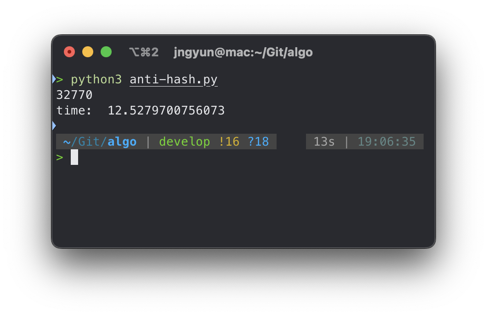

> ## TL;DL
>
> 특정 상황에서 파이썬의 dict와 set은 O(n^2)으로 동작합니다.

## 해시 테이블에 대한 간단한 정보

Open-addressing hash table은 hash값 충돌이 발생했을때 Linked List와 같은 추가적인 메모리 공간을 사용하지 않고, hash table array의 빈 공간을 사용하는 방법입니다. 만약 여러 원소의 해시가 배열의 같은 셀을 가르킬 경우, 해시 테이블은 설정한 규칙에 따라 다른 셀을 가르키도록 합니다.

보통 서로소인 a, b와 f(x) = (a\*x + b)%size을 통해 f(x), f(f(x)), f(f(f(x))), ... 와 같이 빈 공간이 발견 될 때까지 선형 변환을 재귀적으로 반복합니다.

## Python

Python은 2의 거듭제곱 사이즈의 배열을 가지는 hash table을 이용하여 dict을 구현합니다. 위에서 언급한 선형 변환보다는 약간 더 복잡한 f(x) = (5x + 1 + _preturb_)%size 를 사용합니다. 여기서 \_preturb\_의 초기값은 hash와 같지만 매 단계마다 32로 나눠진다. 이에 대한 구현 및 자세한 설명은 아래 레포지토리를 참고하면 좋을 듯 합니다.

[https://github.com/python/cpython/blob/3.8/Objects/dictobject.c#L135](https://github.com/python/cpython/blob/3.8/Objects/dictobject.c#L135)

Python int 자료형의 hash 함수는 값 그대로이기 때문에 예측하기가 매우 쉽습니다.

```python
>>> [hash(x) for x in range(10)]
[0, 1, 2, 3, 4, 5, 6, 7, 8, 9]
```

따라서 특정 번호에 대해 검색하도록 하는 인덱스들의 시퀀스를 찾고 선점한다면, 딕셔너리에서 해시 충돌을 피하기 위한 탐색을 유발하고 결국 실행 시간이 길어지게 됩니다.

## 예제

원글에서도 hack의 예시로 사용된 제 풀이 입니다.

```python
from collections import defaultdict

for _ in range(int(input())):
  n = int(input())
  l = list(map(int, input().split()))
  d = defaultdict(int)
  for i in range(n):
    d[l[i]] += 1
  MAX = 0
  for i, v in d.items():
    MAX = max(MAX, v)
  t = n - MAX
  a = 0
  while MAX < n:
    MAX *= 2
    a += 1
  print(a+t)
```

hack input을 생성해서 테스트해보았습니다.

```python
from collections import defaultdict
import time

def solve(n, l):
  d = defaultdict(int)
  for i in range(n):
    d[l[i]] += 1
  MAX = 0
  for i, v in d.items():
    MAX = max(MAX, v)
  t = n - MAX
  a = 0
  while MAX < n:
    MAX *= 2
    a += 1
  print(a+t)


mask = (1<<16)-1
N = 10**5
prefill = (1<<15) + 1
l = [mask+1]
x = 1
for i in range(1, prefill):
  l.append(x)
  x = x*5 + 1
  x &= mask
for i in range(prefill, N):
  l.append(0)

start = time.time()
solve(N, l)
print("time: ", time.time() - start)
```



## 해결책

str으로 캐스팅하여 해시를 예측하기 어렵게 만들 수 있습니다.

혹은 원글의 필자가 소개한 것처럼 다음과 같은 방법으로 커스텀 타입을 만들고 해시함수를 다르게 정의할 수 있습니다.

```python
from random import getrandbits

RANDOM = getrandbits(32)

class Wrapper(int):
    def __init__(self, x):
        int.__init__(x)
    def __hash__(self):
        return super(Wrapper, self).__hash__() ^ RANDOM

print([hash(x) for x in range(5)])
## [0, 1, 2, 3, 4]
print([hash(Wrapper(x)) for x in range(5)])
## [2129021029, 2129021028, 2129021031, 2129021030, 2129021025]
print([hash(str(x)) for x in range(5)])
## [-5039433375330228259, -3486952520122288577, -8645858109351545456, -7072236602376142849, 5720728269243863574]


d = {}
for i in range(5):
  d[Wrapper(i)] = i
print(d)
## {0: 0, 1: 1, 2: 2, 3: 3, 4: 4}
```

정수형을 dict의 key로 사용하는 풀이는 해당 hack에 취약합니다. 조심하도록 합시다!

Ref:

[https://codeforces.com/blog/entry/101817](https://codeforces.com/blog/entry/101817)

[https://foss.heptapod.net/pypy/pypy/-/issues/3725](https://foss.heptapod.net/pypy/pypy/-/issues/3725)
