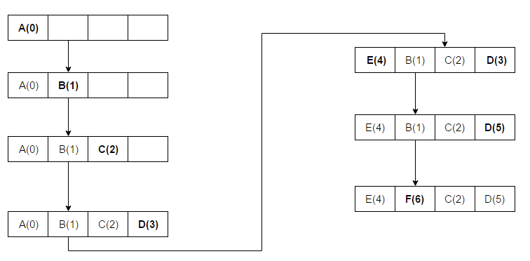

> ## TL;DR
>
> **LRU Cache**는 Least-recently-used cache의 약자입니다. 이 글에서는 파이썬 functools의 lru_cache 데코레이터에 대해 소개합니다.

## LRU Cache

LRU는 OS의 페이지 교체 알고리즘의 하나로 가장 오래 사용하지 않은 페이지를 교체하는 기법입니다. 캐시 공간이 부족하면 가장 최근에 사용하지 않은 항목을 제거합니다.



위의 예시에서 A - B - C - D - E - D - F 순으로 조회합니다. 괄호 안의 숫자는 타임스탬프입니다. 숫자가 작을수록 오래된 데이터입니다. 즉 캐시가 가득찬 경우에 가장 숫자가 작은 데이터가 방출되고 그 자리에 새 데이터가 캐시에 저장됩니다.

## `@lru_cache` In Python

Python에서는 내장라이브러리인 functools에서 lru_cache 데코레이터를 제공해줍니다.

데코레이터를 사용하면 함수를 수정하지 않고도 유연하게 함수에 특정 동작을 추가하거나 작동 방식을 바꿀 수 있습니다.

다음 코드를 통해 사용법을 봅시다. 피보나치 수열의 n번째 항을 구하는 예제입니다.

```python
from functools import lru_cache
@lru_cache
def fib(n):
  if n<2:
    return n
  else:
    return fib(n-1)+fib(n-2)
print(fib(100))
```

데코레이터가 없이 일반적으로 떠올리는 풀이는 메모이제이션입니다. 그러나 여기서는 `@lru_cache`로 `fib` 함수를 랩핑한게 전부입니다.

`@functools.lru_cache(maxsize=128, typed=False)` 를 통해 가장 최근의 _maxsize_ 호출에 대한 실행 결과를 캐싱합니다. 결과를 캐시하는데는 딕셔너리가 사용되기 때문에 모든 인자(순서)가 **hashable** 타입이어야 합니다. 따라서 **mutable** 한 `dictionary`, `set`, `list` 등을 인자로 받는 함수의 경우에는 캐싱할 수 없습니다. 이런 타입을 인자로 받는 함수는 그 인자를 fronzenset이나 tuple 같은 immutable타입으로 변환해야 합니다.

또 한가지 주의해야할 점이 있는데 이는 소스코드를 조금 들여다보면 그 이유를 알 수 있습니다.

```python
def _lru_cache_wrapper(user_function, maxsize, typed, _CacheInfo):
    # Constants shared by all lru cache instances:
    sentinel = object()          # unique object used to signal cache misses
    make_key = _make_key         # build a key from the function arguments
    PREV, NEXT, KEY, RESULT = 0, 1, 2, 3   # names for the link fields

    # 이하생략
```

여기서 `_make_key` 부분을 조금 더 봅시다.

```python
def _make_key(args, kwds, typed,
             kwd_mark = (object(),),
             fasttypes = {int, str},
             tuple=tuple, type=type, len=len):
    key = args
    if kwds:
        key += kwd_mark
        for item in kwds.items():
            key += item
    if typed:
        key += tuple(type(v) for v in args)
        if kwds:
            key += tuple(type(v) for v in kwds.values())
    elif len(key) == 1 and type(key[0]) in fasttypes:
        return key[0]
    return _HashedSeq(key)
```

다음과 같은 주석이 있습니다.

> All of code below relies on kwds preserving the order input by the user. Formerly, we sorted() the kwds before looping. The new way is _much_ faster; however, it means that f(x=1, y=2) will now be treated as a distinct call from f(y=2, x=1) which will be cached separately.

`_make_key` 함수의 구현은 인자들의 순서나 키워드에도 영항을 받기 때문에 `f(x=1, y=2)`와 `f(y=2, x=1)` 가 별개로 캐시된다는 것을 의미합니다.

`lru_cache` 데코레이터는 캐시의 효율을 측정하고 _maxsize_ 파라미터를 조정하는 것을 돕기 위해 `cache_info()` 함수를 제공합니다. `cache_info()` 함수는 hits, misses, maxsize, 그리고 currsize를 알려주는 `named tuple`을 반환합니다.

```python
>>> print(fib(100))
354224848179261915075

>>> print(fib.cache_info())
CacheInfo(hits=98, misses=101, maxsize=128, currsize=101)
```

또한 캐시를 지우거나 무효로 하기 위한 `cache_clear()` 함수도 있습니다.

여담으로 위 피보나치 예제에서는 *maxsize*가 3이면 충분합니다.

일반적으로 LRU 캐시는 이전에 계산된 값을 재사용하려고 할 때만 사용해야 합니다. 따라서 부작용이 있는 함수, 각 호출에서 고유한 가변 객체를 만들어야 하는 함수, time()이나 random()과 같은 비순수(impure) 함수를 캐시 하는 것은 의미가 없습니다.

구현이 궁금하시다면 다음 소스코드를 참고하시길 바랍니다.

[functools.py](https://github.com/python/cpython/blob/3.10/Lib/functools.py#L525)

## `@cache` in Python

단순하고 가벼운 무제한 함수 캐시입니다. `@lru_cache(maxsize=None)`와 같은 것을 반환하여 이전 값을 제거할 필요가 없기 때문에 크기 제한이 있는 `lru_cache()` 보다 작고 빠릅니다.

Python 3.9에 추가되었습니다.

## 자바스크립트에서 구현

작년에 웹크롤링한 결과를 캐싱해야하는 과제가 있었는데, 해당 과제를 진행하면서 이용했던 LRU Cache 클래스입니다. 구현 목표로 각 항목에 대한 적중 횟수를 카운트해야해서 이에 대한 구현을 추가한 녀석입니다.

```javascript
class Node {
  constructor(key, value, next = null, prev = null, hits = 1) {
    this.key = key;
    this.value = value;
    this.next = next;
    this.prev = prev;
    this.hits = hits;
  }
}

export default class LRUCache {
  constructor(limit = 10) {
    this.size = 0;
    this.limit = limit;
    this.head = null;
    this.tail = null;
    this.cacheMap = {};
  }

  set(key, value) {
    const existingNode = this.cacheMap[key];
    if (existingNode) {
      this.detach(existingNode);
      this.size--;
    } else if (this.size === this.limit) {
      delete this.cacheMap[this.tail.key];
      this.detach(this.tail);
      this.size--;
    }

    if (!this.head) {
      this.head = this.tail = new Node(key, value);
    } else {
      const node = new Node(key, value, this.head);
      this.head.prev = node;
      this.head = node;
    }
    this.cacheMap[key] = this.head;
    this.size++;
  }

  get(key) {
    const existingNode = this.cacheMap[key];
    if (existingNode) {
      const temp = existingNode.hits + 1;
      const value = existingNode.value;
      if (this.head !== existingNode) {
        this.set(key, value);
        this.head.hits = temp;
      }
      existingNode.hits = temp;
      return value;
    }
    return false;
  }

  detach(node) {
    if (node.prev !== null) {
      node.prev.next = node.next;
    } else {
      this.head = node.next;
    }

    if (node.next !== null) {
      node.next.prev = node.prev;
    } else {
      this.tail = node.prev;
    }
  }
}
```

---

### 참고

[functools](https://docs.python.org/3/library/functools.html)

[Cache replacement policies](https://en.wikipedia.org/wiki/Cache_replacement_policies)
